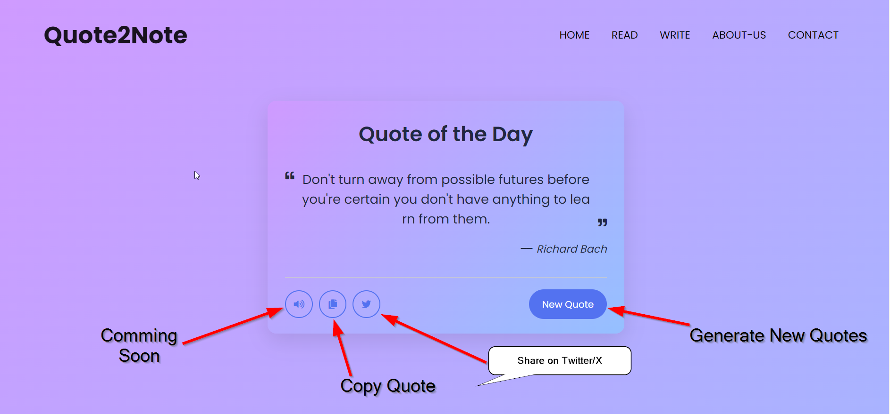
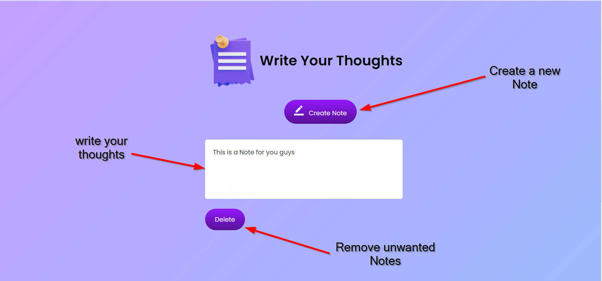

# Quote2Note 

It's a personal inspiration project of mine as I enjoy reading and hearing thought-provoking quotes and journaling my thoughts upon them.

And that's why i'm happy to launch "Quote2Note" because of this.

[Live Website Link](https://surendrapandar.github.io/Quote2Note/)

[Github Repo Link](https://github.com/surendrapandar/Quote2Note)

## Quote Section -

## Write Your Thoughts Section 

After listing or reading something, everyone has a different perspective. We respect this and provide access to notes so that you can respect yours perspective. 

